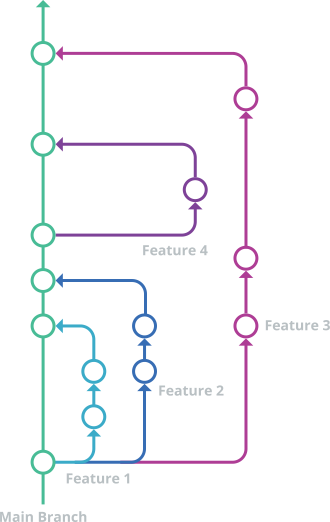

# Git Style

**Summary:** This page gives an overview over different types of git workflows to choose from.

---

## Author

Josef Kircher

## Date

07.11.2022

## Prerequisite

---
<!-- TOC -->
* [Git Style](#git-style)
  * [Author](#author)
  * [Date](#date)
  * [Prerequisite](#prerequisite)
  * [Git workflow](#git-workflow)
    * [Git Feature Branch](#git-feature-branch)
      * [Branch strategy](#branch-strategy)
      * [Pros](#pros)
      * [Cons](#cons)
  * [Git style](#git-style-1)
    * [Branch naming](#branch-naming)
    * [Commit messages](#commit-messages)
    * [Git commands cheat sheet](#git-commands-cheat-sheet)
  * [Sources](#sources)
<!-- TOC -->

## Git workflow

### Git Feature Branch

#### Branch strategy

---

Two types of branches:

* Main: contains production ready code
* Feature: new branches based on main for each feature

#### Pros

---

1. Very simple
2. allows for Continuous Delivery and Continuous integration
3. works great for small teams

#### Cons

---

1. This Git branch strategy is unable to support multiple versions of code in production at the same time.
2. The lack of dedicated development branches makes GitHub flow more susceptible to bugs in production.

## Git style

### Branch naming

---
Feature branch: issue number-description-of-issue      (separator: '-') generated by Github automatically

### Commit messages

---

* proceed to [Commit Messages](./03_commit.md)

### Git commands cheat sheet

---
<https://education.github.com/git-cheat-sheet-education.pdf>

## Sources

<https://www.atlassian.com/git/tutorials/comparing-workflows/gitflow-workflow>

<https://www.atlassian.com/git/tutorials/comparing-workflows/feature-branch-workflow>

<https://www.gitkraken.com/learn/git/best-practices/git-branch-strategy>
