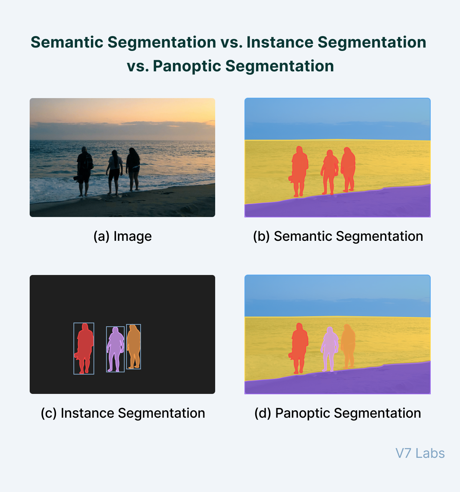

# First Implementation Plan

This document shows the initial ideas for the implementation of the perception module.
It includes the various detection and classification modules that are necessary for an efficient and reliable workflow.

---
## Authors

Marco Riedenauer

## Date

26.11.2022

---
<!-- TOC -->

* [First Implementation Plan](#first-implementation-plan)
    * [Authors](#authors)
    * [Date](#date)
    * [Overview](#overview)
    * [Panoptic Segmentation](#panoptic-segmentation)
        * [Things and Stuff](#things-and-stuff)
        * [Segmentation Overview](#segmentation-overview)
        * [Image Panoptic Segmentation](#image-panoptic-segmentation)
        * [LIDAR Panoptic Segmentation](#lidar-panoptic-segmentation)
        * [Prediction](#prediction)

<!-- TOC -->

---
## Overview

---
## Panoptic Segmentation

### Things and Stuff

#### Things

In computer vision, the term things generally refers to objects that have properly defined geometry and are countable, like a person, cars, animals, etc.

#### Stuff

Stuff is the term used to define objects that don’t have proper geometry but are heavily identified by the texture and material like the sky, road, water bodies, etc.

### Segmentation Overview

There are three different kinds of image segmentation:
- **Semantic Segmentation**: \
    Classification of every pixel or point in an image or LIDAR map into different classes (car, person, street, ...)
- **Instance Segmentation**: \
    Detection of the different instances of things.
- **Panoptic Segmentation**: \
    Combination of semantic segmentation and instance segmentation. Detection of stuff plus instances of things.

[Source](https://www.v7labs.com/blog/panoptic-segmentation-guide)

### Image Panoptic Segmentation

###  LIDAR Panoptic Segmentation

---
## Position Validation

---
## Obstacle Detection and Object Classification

---
## Lane Detection

---
## Traffic Light Detection 

---
## Traffic Sign Detection

---
## Prediction
