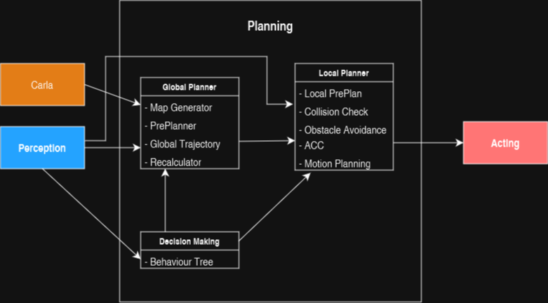
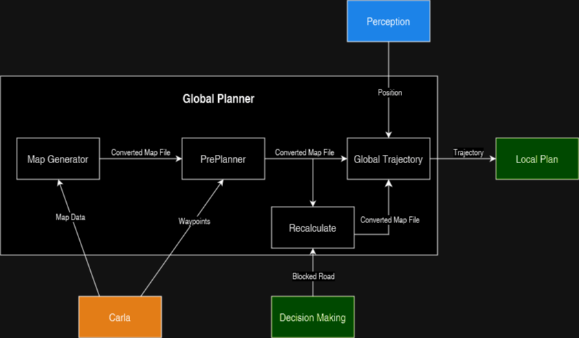
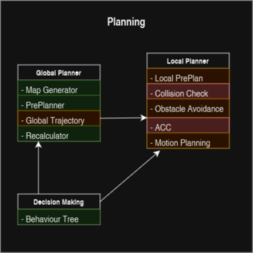

# Planned Architecture

Provide  an overview for a possible planning architecture consisting of Global Planner, Local Planner and Decision Making.

## Overview

The **Global Plan** gathers all data relevant to build a copy of the town the car is driving in. It also computes an optimal global path, which includes all waypoints. The Decision Making can order a recalculation of the global path.

The **Local Plan** segments the global path and calculates how to drive in the lane. It also checks if there is any collision possible.
If there is a collision detected the local path, on the cars lane, can be modified with the obstacle avoidance.
The Speed gets calculated in the motion planning according to the speedlimits of the street, the acc and the choosen behaviour.
Motions like lane changing must be approved by the decision making and they get calculated in the motion planning.

**Decision Making** provides a behaviour tree, which helps perfoming various tasks like lane changing and crossing an intersection.

## Components

### Global Plan

*Map Generator:* Gathers map data from Carla and prepares it for the PrePlanner

- Input: Carla OpenDrive Map
- Output: Converted map data

*Preplanner:* Adds all the waypoints to the map.

- Input: Carla global plan or own global route,
Map Generator data
- Output: Converted Map Data

*Global Trajectory:* Calculates optimal global trajectory (speed is only calculated by given speedlimits)

- Input: Current Position, Preplanner map data, completed checkpoints

- Output: Global Trajectory (middle of the road path, speedlimits)

*Recalculate:* Deletes streets from map, which are undrivable.

- Input: Preplanner map data, position of blocked road

- Output: converted map data

*Why Modular?*

- Easier to inject own waypoints if the leaderboard is not called
- Global Trajectory can be called again without building the whole map again

*Implementation:*

- Global Planner from Paf22
- Can be optimised (some paths are on the walkway)
- variable for completed checkpoints and recalculate needs to be added

Example: Google Maps

### Decision Making

See Behaviour Tree.

*Implementation:*

- Decision Making from Paf22
- behaviours can be refined
- Add new behaviour for a blocked road

### Local Plan

*Local Preplan:* Segements the global path and calculates the middle of the lane. Is not called in every cycle.

- Input: Global Path, Current Position, Lane Detection
- Output: Local Path

*Collision Check:* Check if local path is blocked, calculate with constant speed. Can send emergency brake signal.

- Input: Local Path, Obstacles, current position, current speed

- Output: Collision Object, Object in Front, Emergency Brake Signal

*Obstacle Avoidance:* Modifies local path, on cars lane, so collision is avoided.

- Input: Local Path, Collision Object, Current speed/position
- Output: Modified Local Path

*Motion Planning:* Calculates speed based of behaviours, speedlimit and acc. Also computes path for lane change.

- Input: Modified Local Path, behaviour, acc speed
- Output: Local Trajectory

*Why Modular?*

- Faster Collision check
- Easy change of Algorithms

*Implementation:*

- For Obstacle Avoidance: Pylot - Frenet Optimal Trajectory
- For ACC: Implementation PAF22 or IDM Model
- For Lane Changing: MOBIL Model

*Extra - Visualize Local Trajectory:* Display what should be done: green if accelerating, red if braking, orange holding speed.

- Input: Local Trajectory, current speed
- Output: Visualization

## Interfaces

*Perception:*

- Speed
- GPS values and orientation
- Traffic Light (Distance, State)
- Traffic Sign (Distance, Type)
- Lane Detection (Distance to lane lines)
- Object Detection (Distance, Typ, Orientation)

*Acting:*

- Trajectory (path, speed)
- Emergency Signal

## Prioritisation

Red must have for next Milestone, Orange needed for future milestones, Green can already be used or is not that important

