# Use cases in Carla Leaderboard

**Summary:** This page contains a set of possible use cases containing a description of the scenario, the functions the agent has to have to pass that scenario as well as the event triggering that use case, the flow through that use case and the outcome.

---

## Author

Josef Kircher

## Date

21.11.2022

## Prerequisite

---
<!-- TOC -->
* [Use cases in Carla Leaderboard](#use-cases-in-carla-leaderboard)
  * [Author](#author)
  * [Date](#date)
  * [Prerequisite](#prerequisite)
  * [1. Control loss due to bad road condition](#1-control-loss-due-to-bad-road-condition)
  * [2. Unprotected left turn at intersection with oncoming traffic](#2-unprotected-left-turn-at-intersection-with-oncoming-traffic)
  * [3. Right turn at an intersection with crossing traffic](#3-right-turn-at-an-intersection-with-crossing-traffic)
  * [4. Crossing negotiation at unsignalized intersection](#4-crossing-negotiation-at-unsignalized-intersection)
  * [5. Crossing traffic running a red light at intersection](#5-crossing-traffic-running-a-red-light-at-intersection)
  * [6. Highway merge from on-ramp](#6-highway-merge-from-on-ramp)
  * [7. Highway cut-in from on-ramp](#7-highway-cut-in-from-on-ramp)
  * [8. Static cut-in](#8-static-cut-in)
  * [9. Highway exit](#9-highway-exit)
  * [10. Yield to emergency vehicle](#10-yield-to-emergency-vehicle)
  * [11. Obstacle in lane](#11-obstacle-in-lane)
  * [12. Door Obstacle](#12-door-obstacle)
  * [13. Slow moving hazard at lane edge](#13-slow-moving-hazard-at-lane-edge)
  * [14. Vehicle invading lane on bend](#14-vehicle-invading-lane-on-bend)
  * [15. Longitudinal control after leading vehicle brakes](#15-longitudinal-control-after-leading-vehicle-brakes)
  * [16. Obstacle avoidance without prior action](#16-obstacle-avoidance-without-prior-action)
  * [17. Pedestrian emerging from behind parked vehicle](#17-pedestrian-emerging-from-behind-parked-vehicle)
  * [18. Obstacle avoidance with prior action](#18-obstacle-avoidance-with-prior-action)
  * [19. Parking Cut-in](#19-parking-cut-in)
  * [20. Lane changing to evade slow leading vehicle](#20-lane-changing-to-evade-slow-leading-vehicle)
  * [21. Passing obstacle with oncoming traffic](#21-passing-obstacle-with-oncoming-traffic)
  * [22. Parking Exit](#22-parking-exit)
  * [Sources](#sources)
<!-- TOC -->

---

## 1. Control loss due to bad road condition

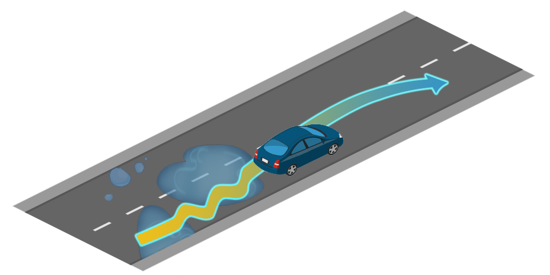

### Description

The ego-vehicle loses control due to bad conditions on the road, and it must recover, coming back to its original lane.

### Pre-condition(Event)

Loss of control

### Driving functions

* Control steering angle, throttle and brake to counter unexpected movements

* (Opt): Sense wheel friction to predict unexpected behaviour

### Outcome

Stabilize the car and continue driving

### Associated use cases

None

---

## 2. Unprotected left turn at intersection with oncoming traffic

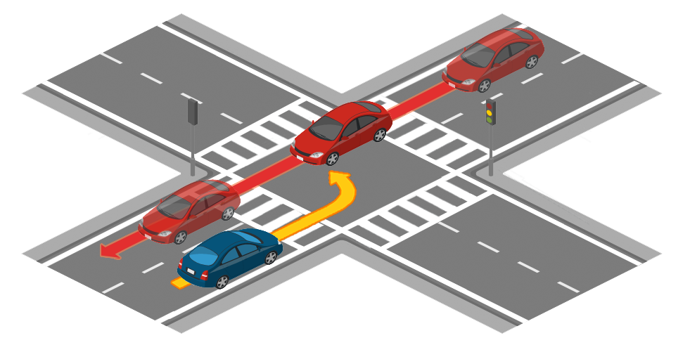

### Description

The ego-vehicle is performing an unprotected left turn at an intersection, yielding to oncoming traffic.

### Basic flow

1. Check for traffic lights
2. If traffic lights are off, look for street signs
3. If there are no street signs, the first to enter the intersection has priority
4. If traffic rules permit to enter the intersection, check if intersection is clear
5. Yield to oncoming traffic and bicycles
6. Perform the turn

### Pre-condition(Event)

Global route wants you to perform a left turn at an intersection

### Driving functions

* Sense street signs and traffic lights
* Observe the intersection
* Sense oncoming traffic
* (Check indicator of oncoming traffic)
* Sense pedestrians in your drive path
* Steer the vehicle in a left turn
* Predict if a turn is possible before oncoming traffic reaches the intersection

### Outcome

Turn left at the intersection without violating traffic rules

### Associated use cases

[3. Right turn at an intersection with crossing traffic](#3-right-turn-at-an-intersection-with-crossing-traffic)

[4. Crossing negotiation at unsignalized intersection](#4-crossing-negotiation-at-unsignalized-intersection)

[18. Obstacle avoidance with prior action](#18-obstacle-avoidance-with-prior-action)

[21. Passing obstacle with oncoming traffic](#21-passing-obstacle-with-oncoming-traffic)

---

## 3. Right turn at an intersection with crossing traffic

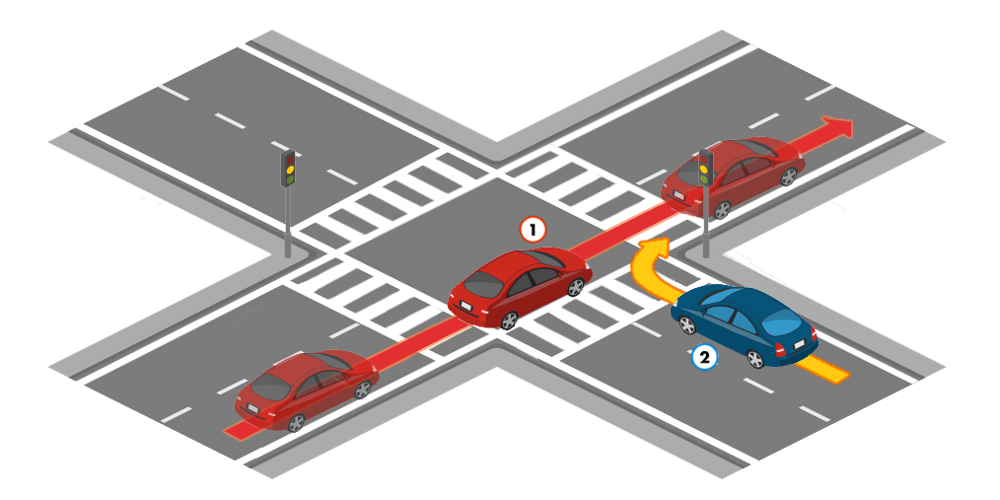

### Description

The ego-vehicle is performing a right turn at an intersection, yielding to crossing traffic.

### Basic flow

1. Check for traffic lights
2. If traffic lights are off, look for street signs
3. If there are no street signs, the first to enter the intersection has priority
4. If traffic rules permit to turn right, check if there is crossing traffic
5. Perform the turn

### Pre-condition(Event)

Global route wants you to perform a right turn at an intersection

### Driving functions

* Sense street signs and traffic lights
* Observe the intersection
* Sense crossing traffic
* Check indicator of crossing traffic
* Sense pedestrians in your drive path
* Steer the vehicle in a right turn
* Predict if a turn is possible before crossing traffic reaches the intersection

### Outcome

Turn right at the intersection without violating traffic rules

### Associated use cases

[2. Unprotected left turn at intersection with oncoming traffic](#2-unprotected-left-turn-at-intersection-with-oncoming-traffic)

[4. Crossing negotiation at unsignalized intersection](#4-crossing-negotiation-at-unsignalized-intersection)

[5. Crossing traffic running a red light at intersection](#5-crossing-traffic-running-a-red-light-at-intersection)

[18. Obstacle avoidance with prior action](#18-obstacle-avoidance-with-prior-action)

---

## 4. Crossing negotiation at unsignalized intersection

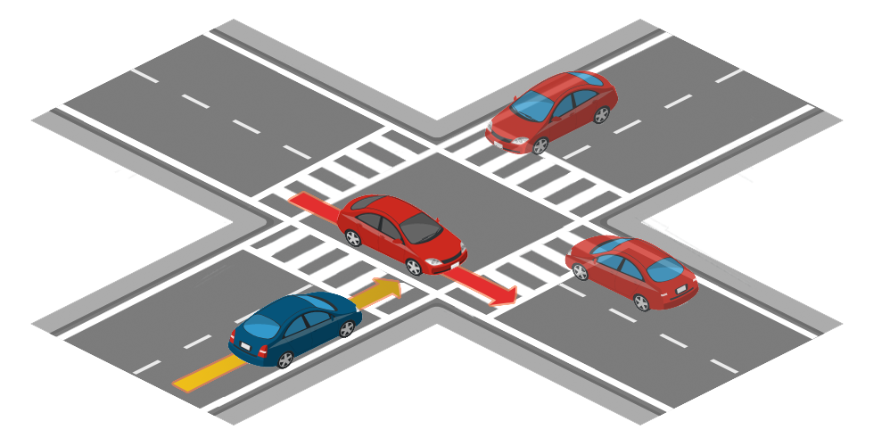

### Description

The ego-vehicle needs to negotiate with other vehicles to cross an unsignalized intersection. In this situation it is assumed that the first to enter the intersection has priority.

### Basic flow

1. Check for traffic lights
2. If traffic lights are off, look for street signs
3. If there are no street signs, the first to enter the intersection has priority
4. Check if intersection is clear
5. If not, wait until intersection is clear
6. Enter the intersection
7. Follow global path

### Pre-condition(Event)

No traffic lights or street signs are sensed and agent is at an intersection

### Driving functions

* Sense street signs and traffic lights
* Observe the intersection
* Sense pedestrians in your drive path
* Steering the vehicle

### Outcome

Cross the intersection without violating traffic rules

### Associated use cases

[2. Unprotected left turn at intersection with oncoming traffic](#2-unprotected-left-turn-at-intersection-with-oncoming-traffic)

[3. Right turn at an intersection with crossing traffic](#3-right-turn-at-an-intersection-with-crossing-traffic)

[18. Obstacle avoidance with prior action](#18-obstacle-avoidance-with-prior-action)

---

## 5. Crossing traffic running a red light at intersection

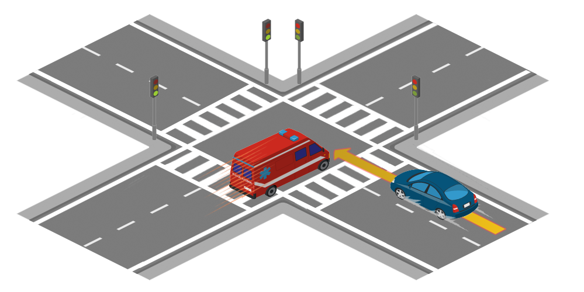

### Description

The ego-vehicle is going straight at an intersection but a crossing vehicle runs a red light, forcing the ego-vehicle to avoid the collision.

### Pre-condition(Event)

Vehicle enters intersection while having a red light

### Driving functions

* Sense street signs and traffic lights
* Observe the intersection
* Sense crossing traffic
* Emergency brake

### Outcome

Emergency brake to avoid collision

### Associated use cases

[3. Right turn at an intersection with crossing traffic](#3-right-turn-at-an-intersection-with-crossing-traffic)

[4. Crossing negotiation at unsignalized intersection](#4-crossing-negotiation-at-unsignalized-intersection)

[16. Obstacle avoidance without prior action](#16-obstacle-avoidance-without-prior-action)

[17. Pedestrian emerging from behind parked vehicle](#17-pedestrian-emerging-from-behind-parked-vehicle)

[18. Obstacle avoidance with prior action](#18-obstacle-avoidance-with-prior-action)

---

## 6. Highway merge from on-ramp

### Description

The ego-vehicle merges into moving highway traffic from a highway on-ramp.

### Basic flow

1. Check speed of vehicles on the next lane
2. Determine length of ramp
3. Adjust speed to find a gap in the traffic
4. Join the highway before ramp ends

### Pre-condition(Event)

Vehicle enters a highway

### Driving functions

* Sense speed of surrounding traffic
* Sense length of ramp
* Adjust speed to enter highway
* Turn into highway

### Outcome

Join the highway traffic without any traffic violation

### Associated use cases

[9. Highway exit](#9-highway-exit)

[20. Lane changing to evade slow leading vehicle](#20-lane-changing-to-evade-slow-leading-vehicle)

[22. Parking Exit](#22-parking-exit)

---

## 7. Highway cut-in from on-ramp

### Description

The ego-vehicle encounters a vehicle merging into its lane from a highway on-ramp. The ego-vehicle must decelerate, brake or change lane to avoid a collision.

### Basic flow

1. Sense vehicle on the on ramp
2. Check speed of vehicles on the left lane
3. If possible, change lane
4. Check speed of vehicle on on-ramp
5. Decelerate or brake to allow vehicle to merge into traffic

### Pre-condition(Event)

Vehicle enters a highway

### Driving functions

* Sense speed of surrounding traffic
* Adjust speed to let vehicle enter highway
* Change lane
* Decelerate
* Brake

### Outcome

Let vehicle join the highway traffic without any traffic violation

### Associated use cases

[8. Static cut-in](#8-static-cut-in)

[16. Obstacle avoidance without prior action](#16-obstacle-avoidance-without-prior-action)

[19. Parking Cut-in](#19-parking-cut-in)

---

## 8. Static cut-in

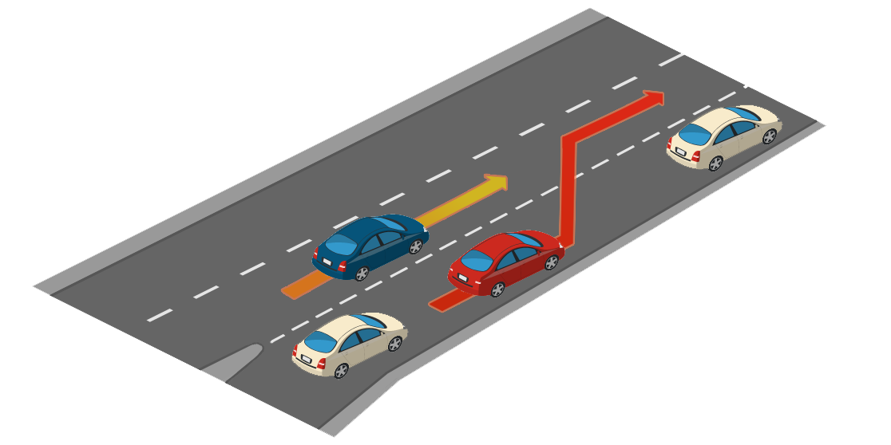

### Description

The ego-vehicle encounters a vehicle cutting into its lane from a lane of static traffic. The ego-vehicle must decelerate, brake or change lane to avoid a collision.

### Basic flow

1. Sense vehicle on the right lane and its intent to switch lanes
2. Check speed of vehicles on the left lane if there is a left lane
3. If possible, change lane
4. Check speed of vehicle on the right
5. Decelerate or brake to allow vehicle to merge into our lane

### Pre-condition(Event)

Vehicle tries to cut-in

### Driving functions

* Sense speed of surrounding traffic
* Adjust speed to let vehicle enter lane
* Change lane
* Decelerate
* Brake

### Outcome

Let vehicle join the lane without any traffic violation

### Associated use cases

[7. Highway cut-in from on-ramp](#7-highway-cut-in-from-on-ramp)

[16. Obstacle avoidance without prior action](#16-obstacle-avoidance-without-prior-action)

[19. Parking Cut-in](#19-parking-cut-in)

---

## 9. Highway exit

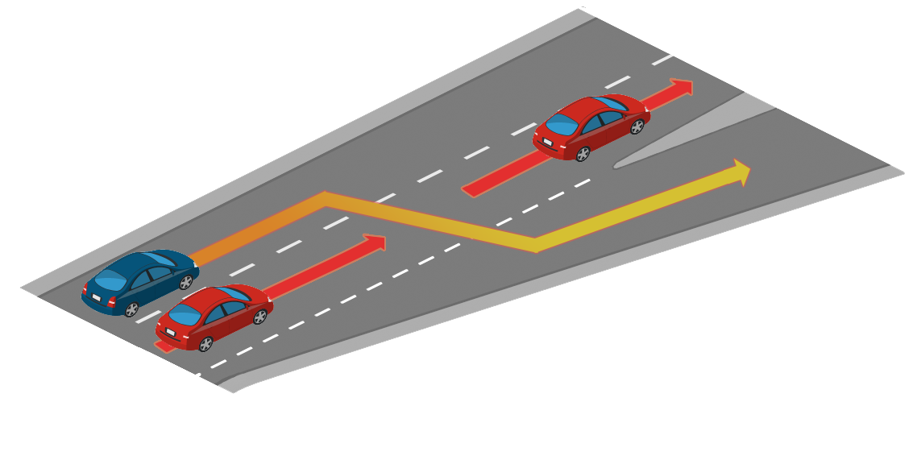

### Description

The ego-vehicle must cross a lane of moving traffic to exit the highway at an off-ramp.

### Basic flow

1. Sense vehicle on the right lane
2. Check speed of vehicles on the right lane
3. Check distance to off-ramp
4. If possible, change lane
5. Accelerate or decelerate to change into right lane
6. Change lane
7. Change lane to off-ramp
8. Decelerate or brake when leaving high-way

### Pre-condition(Event)

Vehicle leaves a highway

### Driving functions

* Sense speed of surrounding traffic
* Sense distance to off-ramp
* Adjust speed to change lane
* Change lane
* Decelerate
* Brake

### Outcome

Vehicle exits the highway traffic without any traffic violation

### Associated use cases

[6. Highway merge from on-ramp](#6-highway-merge-from-on-ramp)

[20. Lane changing to evade slow leading vehicle](#20-lane-changing-to-evade-slow-leading-vehicle)

[22. Parking Exit](#22-parking-exit)

---

## 10. Yield to emergency vehicle

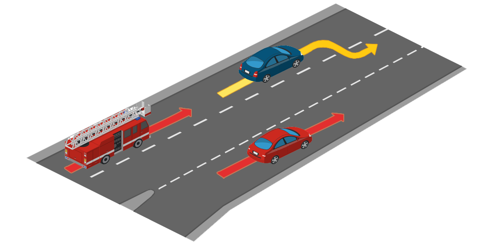

### Description

The ego-vehicle is approached by an emergency vehicle coming from behind. The ego-vehicle must maneuver to allow the emergency vehicle to pass.

### Basic flow

1. Sense emergency vehicle behind the agent
2. Check speed of vehicles on the surrounding lanes
3. If possible, change lane
4. Adjust speed to perform a lane change
5. Change lane
6. Let emergency vehicle pass

### Pre-condition(Event)

Emergency vehicle behind us

### Driving functions

* Sense emergency vehicle
* Sense speed of surrounding traffic
* Adjust speed to change lane
* Change lane

### Outcome

Let emergency vehicle pass without any traffic violation

### Associated use cases

[11. Obstacle in lane](#11-obstacle-in-lane)

[20. Lane changing to evade slow leading vehicle](#20-lane-changing-to-evade-slow-leading-vehicle)

---

## 11. Obstacle in lane

### Description

The ego-vehicle encounters an obstacle blocking the lane and must perform a lane change to avoid it. The obstacle may be a construction site, an accident or a parked vehicle.

### Basic flow

1. Sense obstacle in the lane
2. Check speed of vehicles on the surrounding lanes
3. If possible, change lane
4. Decelerate or brake to avoid collision with obstacle
5. If a sufficient gap in the traffic opens, change lane
6. After obstacle re-merge former lane

### Pre-condition(Event)

Obstacle on lane

### Driving functions

* Sense obstacles
* Sense speed of surrounding traffic
* Change lane
* Decelerate
* Brake

### Outcome

Pass an obstacle without any traffic violation

### Associated use cases

[6. Highway merge from on-ramp](#6-highway-merge-from-on-ramp)

[10. Yield to emergency vehicle](#10-yield-to-emergency-vehicle)

[12. Door Obstacle](#12-door-obstacle)

[13. Slow moving hazard at lane edge](#13-slow-moving-hazard-at-lane-edge)

[15. Longitudinal control after leading vehicle brakes](#15-longitudinal-control-after-leading-vehicle-brakes)

[16. Obstacle avoidance without prior action](#16-obstacle-avoidance-without-prior-action)

[17. Pedestrian emerging from behind parked vehicle](#17-pedestrian-emerging-from-behind-parked-vehicle)

[20. Lane changing to evade slow leading vehicle](#20-lane-changing-to-evade-slow-leading-vehicle)

[21. Passing obstacle with oncoming traffic](#21-passing-obstacle-with-oncoming-traffic)

---

## 12. Door Obstacle

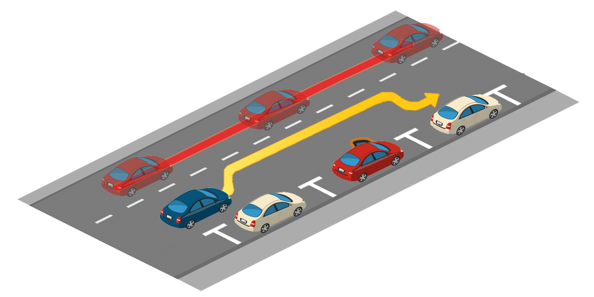

### Description

The ego-vehicle encounters a parked vehicle opening a door into its lane and must maneuver to avoid it.

### Basic flow

1. Sense door obstacle in the lane
2. Check speed of vehicles on the surrounding lanes
3. If possible, change lane
4. Decelerate or brake to avoid collision with obstacle
5. If a sufficient gap in the traffic opens, change lane
6. After obstacle re-merge former lane

### Pre-condition(Event)

Door opens in lane

### Driving functions

* Sense opening door
* Sense speed of surrounding traffic
* Change lane
* Decelerate
* Brake

### Outcome

Pass the open door without any traffic violation

### Associated use cases

[11. Obstacle in lane](#11-obstacle-in-lane)

[13. Slow moving hazard at lane edge](#13-slow-moving-hazard-at-lane-edge)

[15. Longitudinal control after leading vehicle brakes](#15-longitudinal-control-after-leading-vehicle-brakes)

[16. Obstacle avoidance without prior action](#16-obstacle-avoidance-without-prior-action)

[17. Pedestrian emerging from behind parked vehicle](#17-pedestrian-emerging-from-behind-parked-vehicle)

[21. Passing obstacle with oncoming traffic](#21-passing-obstacle-with-oncoming-traffic)

---

## 13. Slow moving hazard at lane edge

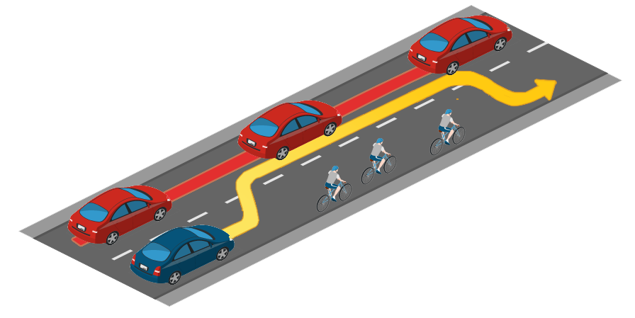

### Description

The ego-vehicle encounters a slow moving hazard blocking part of the lane. The ego-vehicle must brake or maneuver to avoid it

### Basic flow

1. Sense slow moving hazard in the lane
2. Check speed of vehicles on the surrounding lanes
3. If possible, change lane
4. Decelerate or brake to avoid collision with obstacle
5. If a sufficient gap in the traffic opens, change lane
6. After obstacle re-merge former lane

### Pre-condition(Event)

slow moving hazard(bicycle) in lane

### Driving functions

* Sense slow moving hazards
* Sense speed of surrounding traffic
* Change lane
* Decelerate
* Brake

### Outcome

Pass the slow moving hazard without any traffic violation

### Associated use cases

[11. Obstacle in lane](#11-obstacle-in-lane)

[12. Door Obstacle](#12-door-obstacle)

[16. Obstacle avoidance without prior action](#16-obstacle-avoidance-without-prior-action)

[17. Pedestrian emerging from behind parked vehicle](#17-pedestrian-emerging-from-behind-parked-vehicle)

[20. Lane changing to evade slow leading vehicle](#20-lane-changing-to-evade-slow-leading-vehicle)

[21. Passing obstacle with oncoming traffic](#21-passing-obstacle-with-oncoming-traffic)

---

## 14. Vehicle invading lane on bend

### Description

The ego-vehicle encounters an oncoming vehicles invading its lane on a bend due to an obstacle. It must brake or maneuver to the side of the road to navigate past the oncoming traffic.

### Basic flow

1. Sense vehicle on our lane
2. Decelerate or brake to avoid collision with vehicle
3. Steer to the right part of the lane
4. After vehicle passed continue on lane

### Pre-condition(Event)

Bend in the road and a vehicle invading our lane

### Driving functions

* Sense vehicle on our lane
* Decelerate
* Brake
* Move to right part of lane

### Outcome

Let vehicle pass without any traffic violation

### Associated use cases

None

---

## 15. Longitudinal control after leading vehicle brakes

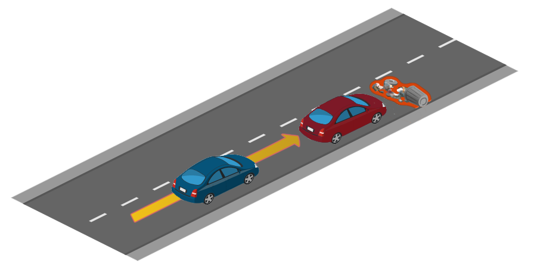

### Description

The leading vehicle decelerates suddenly due to an obstacle and the ego-vehicle must perform an emergency brake or an avoidance maneuver.

### Basic flow

1. Sense speed of vehicle in front of agent
2. Detect sudden deceleration (maybe by brake lights)
3. Decelerate or brake to avoid collision with vehicle

### Pre-condition(Event)

Vehicle in front suddenly slows down

### Driving functions

* Sense vehicle on our lane
* Sense vehicle speed
* Decelerate
* Emergency-/Brake

### Outcome

Slow down without crashing in vehicle in front of us

### Associated use cases

[11. Obstacle in lane](#11-obstacle-in-lane)

[12. Door Obstacle](#12-door-obstacle)

[16. Obstacle avoidance without prior action](#16-obstacle-avoidance-without-prior-action)

[17. Pedestrian emerging from behind parked vehicle](#17-pedestrian-emerging-from-behind-parked-vehicle)

[21. Passing obstacle with oncoming traffic](#21-passing-obstacle-with-oncoming-traffic)

---

## 16. Obstacle avoidance without prior action

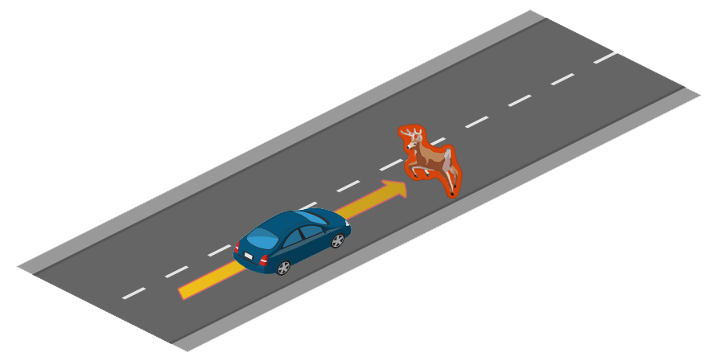

### Description

The ego-vehicle encounters an obstacle / unexpected entity on the road and must perform an emergency brake or an avoidance maneuver.

### Basic flow

1. Sense obstacle in front of agent
2. Decelerate or brake to avoid collision with obstacle

### Pre-condition(Event)

Obstacle in front suddenly appears

### Driving functions

* Sense obstacle on our lane
* Decelerate
* Emergency-/Brake

### Outcome

Slow down without crashing in the obstacle in front of us

### Associated use cases

[5. Crossing traffic running a red light at intersection](#5-crossing-traffic-running-a-red-light-at-intersection)

[7. Highway cut-in from on-ramp](#7-highway-cut-in-from-on-ramp)

[8. Static cut-in](#8-static-cut-in)

[11. Obstacle in lane](#11-obstacle-in-lane)

[12. Door Obstacle](#12-door-obstacle)

[13. Slow moving hazard at lane edge](#13-slow-moving-hazard-at-lane-edge)

[15. Longitudinal control after leading vehicle brakes](#15-longitudinal-control-after-leading-vehicle-brakes)

[17. Pedestrian emerging from behind parked vehicle](#17-pedestrian-emerging-from-behind-parked-vehicle)

[19. Parking Cut-in](#19-parking-cut-in)

[21. Passing obstacle with oncoming traffic](#21-passing-obstacle-with-oncoming-traffic)

---

## 17. Pedestrian emerging from behind parked vehicle

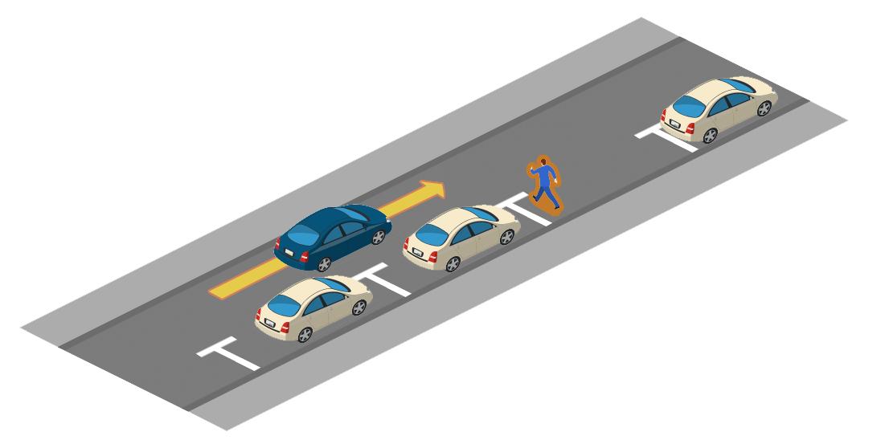

### Description

The ego-vehicle encounters a pedestrian emerging from behind a parked vehicle and advancing into the lane. The ego-vehicle must brake or maneuver to avoid it.

### Basic flow

1. Sense pedestrian in front of agent
2. Decelerate or brake to avoid collision with obstacle

### Pre-condition(Event)

Pedestrian in front suddenly appears from behind a parked car.

### Driving functions

* Sense pedestrian on our lane
* Decelerate
* Emergency-/Brake

### Outcome

Slow down without crashing into the pedestrian in front of us

### Associated use cases

[5. Crossing traffic running a red light at intersection](#5-crossing-traffic-running-a-red-light-at-intersection)

[11. Obstacle in lane](#11-obstacle-in-lane)

[12. Door Obstacle](#12-door-obstacle)

[13. Slow moving hazard at lane edge](#13-slow-moving-hazard-at-lane-edge)

[15. Longitudinal control after leading vehicle brakes](#15-longitudinal-control-after-leading-vehicle-brakes)

[16. Obstacle avoidance without prior action](#16-obstacle-avoidance-without-prior-action)

---

## 18. Obstacle avoidance with prior action

### Description

While performing a maneuver, the ego-vehicle finds an obstacle on the road and must perform an emergency brake or an avoidance maneuver.

### Basic flow

1. Sense obstacle in planned driving path of agent
2. Decelerate or brake to avoid collision with obstacle

### Pre-condition(Event)

Obstacle in planned driving path

### Driving functions

* Sense obstacle in driving path
* Decelerate
* Emergency-/Brake

### Outcome

Slow down without crashing into the obstacle in our path

### Associated use cases

[2. Unprotected left turn at intersection with oncoming traffic](#2-unprotected-left-turn-at-intersection-with-oncoming-traffic)

[3. Right turn at an intersection with crossing traffic](#3-right-turn-at-an-intersection-with-crossing-traffic)

[4. Crossing negotiation at unsignalized intersection](#4-crossing-negotiation-at-unsignalized-intersection)

[5. Crossing traffic running a red light at intersection](#5-crossing-traffic-running-a-red-light-at-intersection)

---

## 19. Parking Cut-in

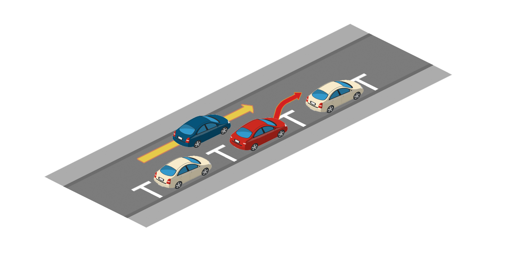

### Description

The ego-vehicle must slow down or brake to allow a parked vehicle exiting a parallel parking bay to cut in front.

### Basic flow

1. Sense parked car planning to join lane of agent
2. Decelerate or brake to avoid collision with vehicle

### Pre-condition(Event)

Parked car tries to join traffic

### Driving functions

* Sense parked car starts moving
* Decelerate
* Emergency-/Brake

### Outcome

Slow down without crashing into the car joining our lane

### Associated use cases

[7. Highway cut-in from on-ramp](#7-highway-cut-in-from-on-ramp)

[8. Static cut-in](#8-static-cut-in)

[16. Obstacle avoidance without prior action](#16-obstacle-avoidance-without-prior-action)

---

## 20. Lane changing to evade slow leading vehicle

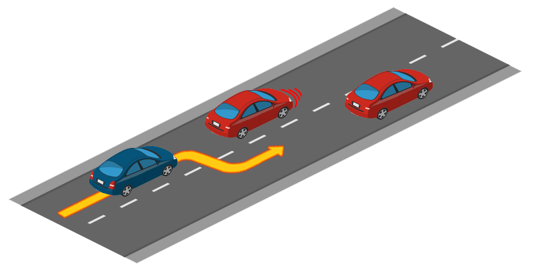

### Description

The ego-vehicle performs a lane changing to evade a leading vehicle that is moving too slowly.

### Basic flow

1. Sense car speed in front of us
2. Check if car speed is too low
3. Check speed of vehicles in neighbouring lanes
4. If possible change lane
5. Otherwise, wait until lane change is possible and slow down
6. Change lane

### Pre-condition(Event)

Speed of car is under a certain threshold

### Driving functions

* Sense speed of traffic
* Sense vehicles in surrounding lanes
* Decelerate
* Emergency-/Brake
* Change lane

### Outcome

Change lane without any traffic violations

### Associated use cases

[10. Yield to emergency vehicle](#10-yield-to-emergency-vehicle)

[11. Obstacle in lane](#11-obstacle-in-lane)

[13. Slow moving hazard at lane edge](#13-slow-moving-hazard-at-lane-edge)

[21. Passing obstacle with oncoming traffic](#21-passing-obstacle-with-oncoming-traffic)

[22. Parking Exit](#22-parking-exit)

---

## 21. Passing obstacle with oncoming traffic

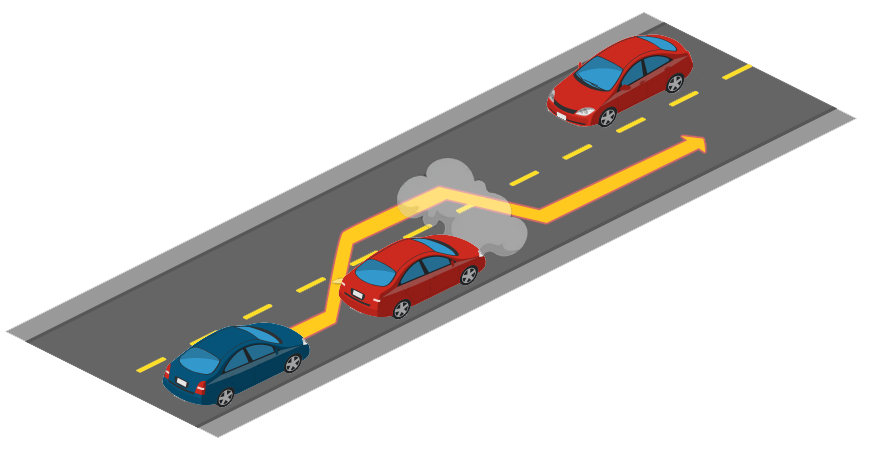

### Description

The ego-vehicle must go around a blocking object using the opposite lane, yielding to oncoming traffic.

### Basic flow

1. Sense obstacle in front of us
2. Check distance and speed of oncoming traffic
3. If oncoming traffic is far enough away, maneuver around obstacle
4. Otherwise, wait until lane change is possible and slow down
5. Maneuver around vehicle

### Pre-condition(Event)

Obstacle in front of us with oncoming traffic

### Driving functions

* Sense obstacle
* Sense length of obstacle
* Sense speed, distance of oncoming traffic
* Sense vehicles in surrounding lanes
* Decelerate
* Brake
* Change lane
* Rejoin old lane after the obstacle

### Outcome

Maneuver around obstacle without any traffic violations

### Associated use cases

[2. Unprotected left turn at intersection with oncoming traffic](#2-unprotected-left-turn-at-intersection-with-oncoming-traffic)

[11. Obstacle in lane](#11-obstacle-in-lane)

[12. Door Obstacle](#12-door-obstacle)

[13. Slow moving hazard at lane edge](#13-slow-moving-hazard-at-lane-edge)

[15. Longitudinal control after leading vehicle brakes](#15-longitudinal-control-after-leading-vehicle-brakes)

[16. Obstacle avoidance without prior action](#16-obstacle-avoidance-without-prior-action)

[20. Lane changing to evade slow leading vehicle](#20-lane-changing-to-evade-slow-leading-vehicle)

---

## 22. Parking Exit

### Description

The ego-vehicle must exit a parallel parking bay into a flow of traffic.

### Basic flow

1. Check distance and speed of traffic
2. If traffic is far enough away, join traffic
3. Otherwise, wait until lane is free
4. Join traffic

### Pre-condition(Event)

Ego-vehicle is parked and wants to join traffic

### Driving functions

* Sense space of parking bay
* Sense speed, distance of traffic
* Sense vehicles in lane the agent wants to join
* Accelerate
* Change lane(Join traffic)

### Outcome

Join traffic without any traffic violations

### Associated use cases

[6. Highway merge from on-ramp](#6-highway-merge-from-on-ramp)

[9. Highway exit](#9-highway-exit)

[20. Lane changing to evade slow leading vehicle](#20-lane-changing-to-evade-slow-leading-vehicle)

---

## Sources

<https://leaderboard.carla.org/scenarios/>
