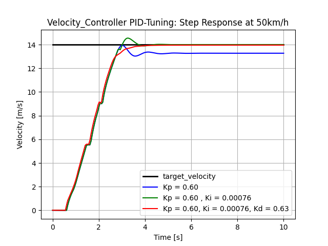
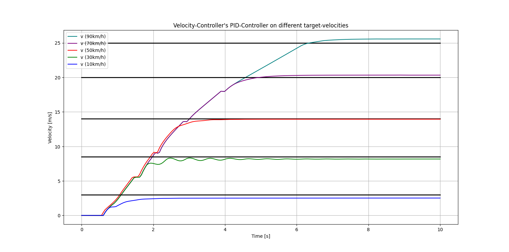

# Overview of the Velocity Controller

**Summary:** This page provides an overview of the current status of the velocity_controller.

---

## Author

Alexander Hellmann

## Date

01.04.2024

<!-- TOC -->
- [Overview of the Velocity Controller](#overview-of-the-velocity-controller)
  - [Author](#author)
  - [Date](#date)
  - [General Introduction to Velocity Controller](#general-introduction-to-velocity-controller)
  - [Current Implementation](#current-implementation)
<!-- TOC -->

## General Introduction to Velocity Controller

The [velocity_controller](../../code/acting/src/acting/velocity_controller.py) implements our way to make the CARLA-Vehicle drive at a ```target_velocity``` (published by Planning) by using a tuned PID-Controller to calculate a ```throttle``` and a ```brake``` for the CARLA-Vehicle-Command.
For more information about PID-Controllers and how they work, follow [this link](https://en.wikipedia.org/wiki/Proportional%E2%80%93integral%E2%80%93derivative_controller).

**IMPORTANT:** The CARLA ```vehicle_control_cmd``` only allows you to use a ```throttle``` and a ```brake``` value, both with an allowed range from 0-1, to control the driven speed.

## Current Implementation

Currently, we use a tuned PID-Controller which was tuned for the speed of 14 m/s (around 50 km/h), as this is the most commonly driven velocity in this simulation:



Be aware, that the CARLA-Vehicle shifts gears automatically, resulting in the bumps you see!
As PID-Controllers are linear by nature, the velocity-system is therefore linearized around 50 km/h, meaning the further you deviate from 50 km/h the worse the controller's performance gets:



As the Velocity Controller also has to handle braking, we currently use ```throttle```-optimized PID-Controller to calculate ```brake``` aswell (Since adding another Controller, like a P-Controller, did not work nearly as well!):


Currently, there is no general backwards-driving implemented here, as this was not needed (other than the [Unstuck Routine](/doc/07_planning/Behavior_detailed.md)).

Negative ```target_velocity``` signals are currently taken care off by  braking until we stand still.
The ONLY exception is a ```target_velocity``` of **-3!**!
A ```target_velocity``` of **-3** indicates the unstuck behavior is running, which expects the car to be driving backwards for a specific amount of time without steering.

When implementing a general backwards driving approach this has to be kept in mind, because we DO NOT try to drive at the speed of -3 m/s. We only use the -3 as a keyword for driving backwards at full throttle for a specefic amount of time!
(see _UnstuckBehavior_ in [maneuvers.py](/code/planning/src/behavior_agent/behaviours/maneuvers.py))

Currently, there is no secondary linearization for lower velocities implemented. If more accuracy in lower velocities is needed, a second tuning for lower velocites may be a smart way to improve the controller's performance!

**NOTE:** This Tuning was achieved back in the Leaderboard 1.0 and may not be optimal anymore in the current Leaderboard 2.0, you are welcome to retune this Controller, if necessary!
