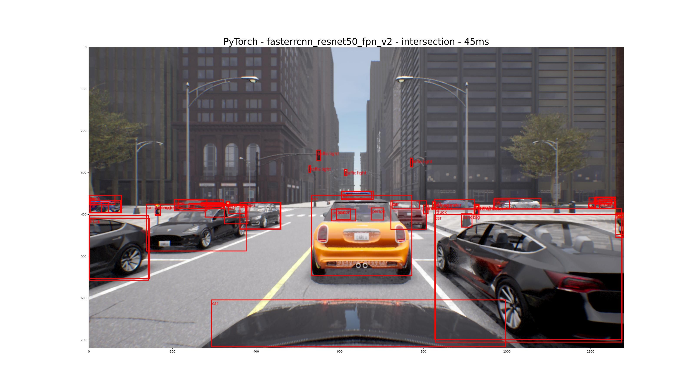
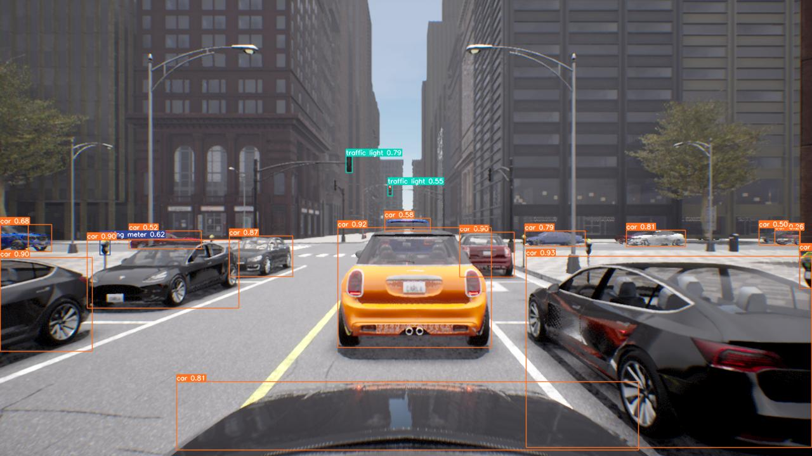

# Model Evaluation Experiment

This experiment was conducted to evaluate different kinds of object detection models for usage in the CARLA simulator.

## Installation

1. Create a virtual environment with `python -m venv venv` while being inside the project's folder.
2. Install the requirements with `pip install -r requirements.txt`
   1. If you have issues, check out the [Tensorflow-Docs](https://www.tensorflow.org/hub/installation), [PyTorch-Docs](https://pytorch.org/get-started/locally/) or [YOLO-Docs](https://docs.ultralytics.com/quickstart/) for installation
3. For the PyLot models (using Tensorflow), also run the following commands ([source](https://www.tensorflow.org/hub/tutorials/tf2_object_detection)):

```shell
git clone --depth 1 https://github.com/tensorflow/models
sudo apt install -y protobuf-compiler
cd models/research/
protoc object_detection/protos/*.proto --python_out=.
cp object_detection/packages/tf2/setup.py .
python -m pip install .
```

For the YOLO-NAS models, also run `pip install super-gradients==3.1.1`. It is recommended to run these models in a seperate venv, e.g. with `python -m venv venv_yolo` to not mix package versions

## Usage

Simply start `yolo.py`, `pt.py` or `pylot.py` to run the respective models and let it save the results.
`globals.py` only holds some global common constants.

## Results

For all models, 8 image directly captured from the CARLA RGB camera were used which depict different traffic scenarios.

*Legend for tables below*: ++, +, /, -, -- (best to worst)

### Pylot Models (Tensorflow)

The following models were evaluated (sorted descending by recognition performance):

1. faster-rcnn
2. ssd-mobilenet-v1-fpn
3. ssd-mobilenet-fpn-640
4. ssd-mobilenet-v1
5. ssdlite-mobilenet-v2

Images with boundary boxes: [Google Drive](https://drive.google.com/drive/folders/1Jk0KNf1-inO1LN8YWoX0nd796w44zp7_?usp=sharing)

#### Summary

|                       | Cyclists | Traffic lights | Cars | Noise | Speed |
|-----------------------|----------|----------------|------|-------|-------|
| faster-rcnn           | --       | --             | ++   | ++    | --    |
| ssd-mobilenet-v1-fpn  | --       | --             | +    | ++    | -     |
| ssd-mobilenet-fpn-640 | --       | --             | -    | ++    | +     |
| ssd-mobilenet-v1      | --       | --             | -    | ++    | ++    |
| ssdlite-mobilenet-v2  | --       | --             | --   | ++    | ++    |

#### Recognition

Overall, `faster-rcnn` performed the best out of these 5 Pylot models. It was able to recognize most cars reliably. The only downside was, pretty much nothing else was detected - like cyclists, traffic lights or construction sites.

`ssd-mobilenet-v1-fpn` recognized significantly less then `faster-rcnn`, but still better than the rest of the Pylot models.

The difference between `ssd-mobilenet-fpn-640` and `ssd-mobilenet-v1` isn't very noticable, both are rather mediocre.

`ssdlite-mobilenet-v2` only recognized the most obvious cars and tended to group multiple cars into one bounding box.

#### Computation speed

These values are meant to be compared between the models, not as a representative performance indicator in general.
Only the inference time was measured.

| Model                     | Time  | FPS  |
|---------------------------|-------|------|
| ssd-mobilenet-v1          | ~4ms  | 250  |
| ssdlite-mobilenet-v2      | ~6ms  | ~166 |
| ssd-mobilenet-fpn-640     | ~9ms  | ~111 |
| ssd-mobilenet-v1-fpn      | ~10ms | 100  |
| faster-rcnn               | ~26ms | ~38  |

### PyTorch Models

The following models were evaluated (sorted descending by recognition performance):

1. fasterrcnn_resnet50_fpn_v2
2. fasterrcnn_mobilenet_v3_large_320_fpn
3. retinanet_resnet50_fpn_v2

Images with boundary boxes: [Google Drive](https://drive.google.com/drive/folders/1AnTCIx351_aXWTcdGusIR4kTUOcomcy-?usp=sharing)

#### Summary

| Model                                 | Cyclists | Traffic lights | Cars | Noise | Speed |
|---------------------------------------|----------|----------------|------|-------|-------|
| fasterrcnn_resnet50_fpn_v2            | ++       | ++             | ++   | -     | --    |
| fasterrcnn_mobilenet_v3_large_320_fpn | ++       | +              | ++   | /     | ++    |
| retinanet_resnet50_fpn_v2             | ++       | ++             | ++   | --    | -     |

#### Recognition

Although, all models performed very well at recognizing all kinds of objects, especially `retinanet_resnet50_fpn_v2` showed a **lot** of noise (see images [above](#pytorch-models)).
When filtering these results for a higher minimum for detection score, these noise issues for all models could perhaps be reduced while keeping the good recogintion performance.

#### Computation speed

These values are meant to be compared between the models, not as a representative performance indicator in general.
Only the inference time was measured.

| Model                                 | Time  | FPS  |
|---------------------------------------|-------|------|
| fasterrcnn_mobilenet_v3_large_320_fpn | ~6ms  | ~166 |
| retinanet_resnet50_fpn_v2             | ~36ms | ~27  |
| fasterrcnn_resnet50_fpn_v2            | ~45ms | ~22  |

### YOLOv8

The model versions are different sizes of the same model.
The following models were evaluated (sorted descending by recognition performance):

1. yolo-nas-l
2. yolo-nas-m
3. yolo-nas-s
4. yolov8x
5. yolov8l
6. yolov8m
7. yolov8s
8. yolov8n

Images with boundary boxes: [Google Drive](https://drive.google.com/drive/folders/1u6T0Q3kd9FqjiBWMqzlT-3-fglMqlkBB?usp=sharing)

#### Summary

| Model      | Cyclists | Traffic lights | Cars | Noise | Speed |
|------------|----------|----------------|------|-------|-------|
| yolo-nas-l | ++       | ++             | ++   | ++    | +     |
| yolo-nas-m | ++       | ++             | ++   | ++    | +     |
| yolo-nas-s | ++       | ++             | ++   | ++    | +     |
| yolov8x    | ++       | ++             | ++   | ++    | +     |
| yolov8l    | ++       | ++             | ++   | ++    | +     |
| yolov8m    | ++       | ++             | ++   | +     | ++    |
| yolov8s    | +        | +              | ++   | ++    | ++    |
| yolov8n    | +        | -              | +    | ++    | ++    |

#### Recognition

All model version performed very well. Only the smallest (`v8n`) version missed some cars. The v8s version was already visibly better, although the `v8x`, `v8l` and `v8m` versions recognized more details - like instead of just a person, they saw a person and a bicycle underneath.

The same can be said for traffic lights - `v8x`, `v8l` and `v8m` saw them from a larger distance, while `v8n` and `v8s` needed more proximity.

The YOLO-NAS family of models are similar to the best `v8` version but with higher confidence scores.

Throughout all versions, almost no noise (random wrong/duplicate predictions ) was present, without tweaking any values - only some noise with `v8m`.

#### Computation speed

These values are meant to be compared between the models, not as a representative performance indicator in general.
Only the inference time was measured.

| Model      | Time | FPS  |
|------------|------|------|
| yolov8n    | ~2ms | 500  |
| yolov8s    | ~2ms | 500  |
| yolov8m    | ~3ms | ~333 |
| yolov8l    | ~4ms | 250  |
| yolov8x    | ~6ms | ~166 |
| yolo-nas-l | ~6ms | ~166 |
| yolo-nas-m | ~6ms | ~166 |
| yolo-nas-s | ~7ms | ~142 |

## Conclusion

Comparing all models with each other, YOLOv8 is currently by far the winner of the comparison. It has the best speed, lowest noise, most detail and reliable recognition - while also being the easiest to use and configure (compare the .py files yourself).

Since the `v8m` version is sometimes to sensitive and the `v8x` version is the largest/slowest, the `v8l` version is a good middle ground, if performance is important.

If the best detection results are the most important, the `v8x` version and `nas` family should be analyzed further with more images and situations.

|  |
|:--:|
| ^ *Pylot - Faster RCNN (26ms)* ^ |
|  |
| ^ *Pytorch - Faster RCNN Resnet50 FPN V2 (45ms)* ^ |
|  |
| ^ *YOLOv8x (6ms)* ^ |
|  |
| ^ *YOLO-nas-l (7ms)* ^ |
