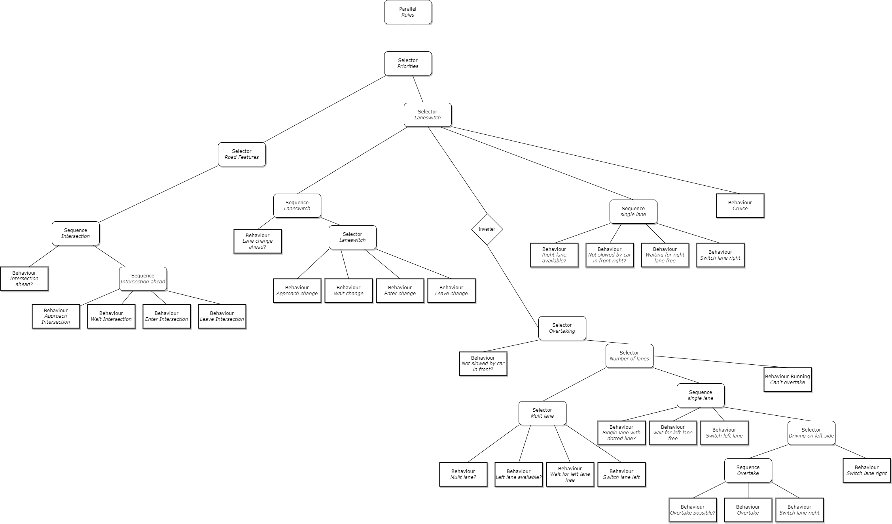

# Pytrees

**Summary:** This document states the current state of the decision tree, with its leafs and evaluations. Explains what data is recieved and processed.

---

## Author

Samuel Kühnel

## Date

26.11.2023

## Overview

### Explanation

A short explanation of all components used.

#### Selector

Tries to execute each of its child behaviors in turn until one is successful. It has a priority hierarchy from left (high priority) to right (low priority).

#### Sequence

Executes all of its child behaviors sequentially after one another until all behaviors have returned `SUCCESS` or one behavior returned `FAILURE`. In that case, the sequence is aborted. If one behaviour returns `RUNNING` the sequence halts and returns the result.

#### Behaviour

Leaf element in the tree representing the actual action that will be executed.

#### Condition

Is always the first child of a sequence. It decides if the sequence should be executed or aborted. Currently implemented as behaviour.

#### Example

To explain everything better we explain the elements with the `Intersection`-Subtree. It is located at the very left side in the preceding selector, so it will be executed with a high priority (so at first).

- The sequence `Intersection` will be executed.
  1. Behaviour `Intersection ahead` will be executed: Checks if intersection is ahead. Returns `FAILURE` if no intersection is ahead and `SUCCESS` if intersection is ahead.
     - `FAILURE`: Sequence aborts and result is returned to root selector `Priorities`. `Priorities` will continue with selector `Laneswitch`.
     - `SUCCESS`: Sequence continues with sequence `Intersection ahead`
  2. Sequence `Intersection ahead`: Executes 4 behaviours sequentially. If every behaviour is executed with `SUCCESS` the seqence will return this result to the parent sequence `Intersection`. If one behaviour returns `RUNNING` or `FAILURE` the sequence will halt and also return the result.

### Inputs and Outpus

#### Subscribed topics from blackboard

- `/paf/hero/traffic_light`:
  - `Approach Intersection`
  - `Wait Intersection`
  - `Enter Intersection`

- `/paf/hero/waypoint_distance`:
  - `Approach Intersection`
  - `Enter intersection`
  - `Intersevtion ahead?`

- `/paf/hero/stop_sign`:
  - `Approach Intersection`

- `/paf/hero/speed_limit`:
  - `Leave intersection`
  - `Leave lane change`

- `/paf/hero/lane_change_distance`:
  - `Approach lane change`
  - `Wait lane change`
  - `Enter lane change`
  - `Lane change ahead?`

- `/paf/hero/lane_status`:
  - `Switch lane left`
  - `Switch lane right`
  - `Mulit-Lane?`
  - `Right lane available?`
  - `Left lane available?`

- `/paf/hero/slowed_by_car_in_front`:
  - `Not slowed by car in front?`

- `/paf/hero/Obstacle_on_left_lane`:
  - `Wait left lane free`

- `/paf/hero/obstacle_on_right_lane`:
  - `Wait for right lane free`

- `/carla/hero/Speed`:
  - `Approach Intersection`
  - `Approach lane change`

- `/carla/hero/LIDAR_range`:
  - `Wait Intersection`

- `/carla/hero/LIDAR_range_rear_left`:
  - `Approach lane change`
  - `Wait lane change`

- `/carla/hero/LIDAR_range_rear_right`:
  - `Approach lane change`
  - `Wait lane change`

### Output

The total tree only publishes the desired velocity in the different situations (e. g. intersections) to the topic `/paf/hero/max_tree_velocity`.

## Status

### Working components

The behaviours that work currently are `Intersection` `Lanewitch`. Altough with some restrictions as no traffic light and obstacle detection information is published.

### Not working components

Due to lacking information a big part of the tree doesn't work. Overtaking currently doesn't work and some behaviors are not implemented i. e. do not contain code and subscriptions:

- `Overtake possible?`
- `Single lane with dotted line?`
- `Overtake`
- `Not slowed by car in front right`
