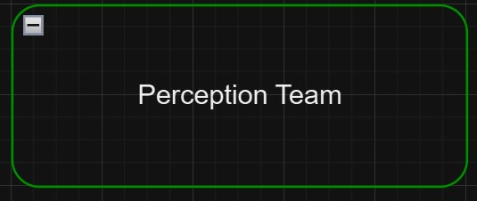
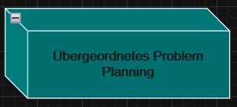
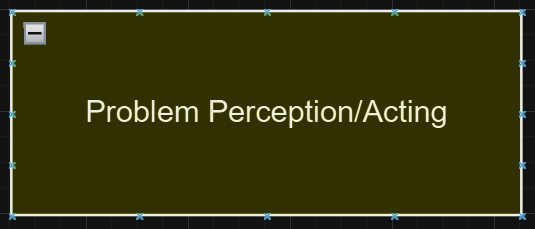
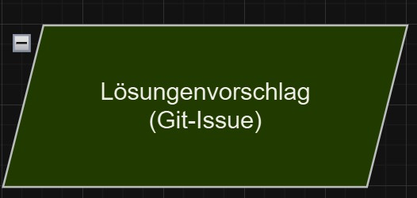

# Drawio Board for planning future work

**Summary:** This page provides an overview of the draw.io board usage and provides links to videos with general tips on how to work with draw.io

- [Drawio Board for planning future work](#drawio-board-for-planning-future-work)
  - [Link](#link)
  - [Legend](#legend)
  - [Tips](#tips)

## Link

To access the draw.io board, please click [here](https://drive.google.com/drive/folders/1dNyrnDdsj0m7kymDQUUqu2WinR4lQJpe)

## Legend

Please use the predefined nodes when working with the board. If you think something is missing, please contact Marcin Kuhnert (Discord: RoyaLxPole) for the PAF24.
Explanation:

This node is primarily for the software engineers who define the goals or sub-goals to be achieved for all teams. The goals should be defined as precisely as possible.These goals are added either in a separate graph or directly above the problems.

This node is for assigning the respective teams or a person from a team. Each team is assigned its own color. Green for Perception, Red for Acting, and Blue for Planning.

This node is used to describe a higher-level problem that cannot currently be defined in detail or can be broken down into smaller problems. As described in the previous node, each team has its own color.
If there is a problem that affects two teams, the color is determined by adding the colors in hexadecimal notation.

Example for problem that affects two teams (HEX: 00FFFF):

This node is used to provide a description for an atomic problem that cannot be further simplified. The color coding for this node applies as described above.

This node is used to describe the approach to the problem. If an issue has already been created on GitHub, the issue number should be included here.

These nodes are used to describe problems that have not yet been assigned to a team or to describe problems that affect all teams equally.

## Tips

For effective work on the board, please watch the following video and read the blog posting.

[Video](https://www.google.com/search?q=draw.io+mind+map+tutorial&rlz=1C1VDKB_deDE929DE929&oq=draw+io+mind&gs_lcrp=EgZjaHJvbWUqCAgDEAAYFhgeMggIABBFGCcYOzIGCAEQRRg5MgcIAhAAGIAEMggIAxAAGBYYHjIICAQQABgWGB4yCAgFEAAYFhgeMgYIBhBFGDwyBggHEEUYPdIBCDgyNzBqMGo3qAIAsAIA&sourceid=chrome&ie=UTF-8#fpstate=ive&vld=cid:6448d106,vid:mooBFL_jhxg,st:0)

[Blog](https://drawio-app.com/blog/organization-charts-and-mind-maps-in-draw-io/)
