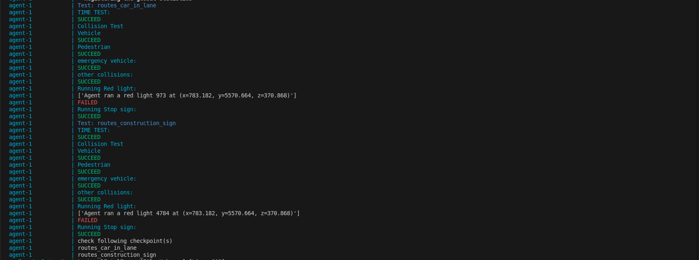

# Automatic Test

**Summary:** The page explains how to start the automated test and what the output looks like. Additionally, it describes how to add a new scenario to the automated test. In an optimal case the test should not need longer than 30 min with 11 routes.

- [Time](#time)
- [Required files](#required-files)
- [Create new test scenario](#create-new-test-scenario)
- [Start Test](#start-test)
- [Output](#output)

## Time

The test shouldn't take longer than 2 minutes per route (with 3 waypoints). So the test with 11 routes (as of 06.02.25) shouldn't take longe than 22 minutes. In the event that the agent gets stuck, the test may take longer because Carla needs a certain amount of time until it aborts the simulation

## Required files

- build/agent_service_test.yaml
- build/docker-compose.test.yaml
- code/routes/test.xml
- code/test/run_test.py
- code/test/index_dict.py

## Definitions

**route**: A predefined way the agent has to take.

**scenario**: A predefined event the agent has to overcome that is triggered by a certain waypoint in the route.

## Create new test route with scenario

For creating a new route, the following must be considered:

1. Create a new route in code/routes/test.xml. The routes always need a unique ID number that increments sequentially. To create a new route, refer to the documentation in [create_new_route.md](/doc/general/create_new_route.md)
2. Create a separate .xml file that exactly reflects this route so that it can later be loaded as a checkpoint. Name the route after the scenario that will be triggered.
3. Add the route to the map in the file doc/general/[load_checkpoints](/doc/general/load_checkpoints.md).
4. Add route to the list in code/test/index_dict.py. The structure of the list is as follows: ID number, scenario name, time allowed to complete the route.

## Start Test

To start a test, simply run the file build/docker-compose.test.yaml with compose up.
Make sure that test.xml is set as the ROUTE variable in build/agent_service_test.yaml.

## Output

Blue: Name of the executed test scenario.

Cyan: Name of the executed test

- If passed, SUCCEED appears in green text below.

- If failed, the error cause is displayed first, followed by FAILED in red text.

At the end, a suggestion is given for which route to review to understand where the errors occurred.
