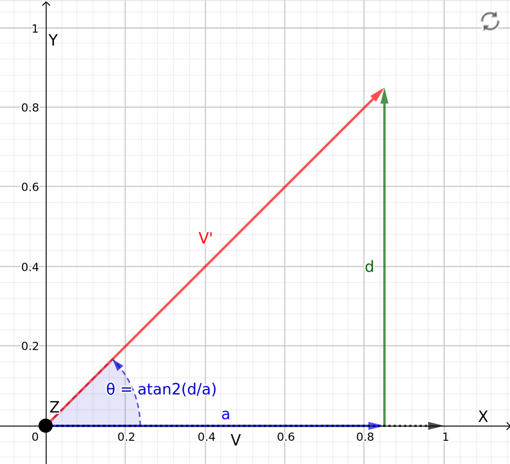

# Coordinate Transformation

**Summary:** Used for various helper functions such as quat_to_heading, that are useful in a lot of cases. **It is not yet fully documented**.

---

## Author

Robert Fischer

## Date

12.01.2024

<!-- TOC -->

- [Coordinate Transformation](#coordinate-transformation)
  - [Author](#author)
  - [Date](#date)
  - [Usage](#usage)
  - [Methods](#methods)
    - [quat\_to\_heading(quaternion)](#quat_to_headingquaternion)

<!-- TOC -->

## Usage

Just importing the coordinate_transformation.py file is enough to use all of its funcions.

```Python
# Example
from coordinate_transformation import quat_to_heading
```

## Methods

This class provides multiple useful methods:

### quat_to_heading(quaternion)

For the cars orientation we need the angle of the cars Heading around the **z-axis**.
We are provided with a Quaternion of the cars Rotation with respect to the Global Coordinate System.

Also the car always starts in the direction of the `x-axis`, which is what our `0 rad point` will be.

To calculate the Heading we first need to create a Rotation Matrix out of the quaternion:

`R = Rotation.from_quat(quaternion).rotation.as_matrix()`

$$
R =
\begin{bmatrix}
    a & b & c\\
    d & e & f\\
    g & h & i\\
\end{bmatrix}
$$

The original vector `V` of the car is `(1,0,0)`, since it spawns looking into the x-axis direction.

$$
V =
\begin{bmatrix}
    1\\
    0\\
    0\\
\end{bmatrix}
$$

To calculate our rotated vector `V'` we do the following:

$$
V' = R \cdot V
$$

$$
\begin{bmatrix}
    a\\
    d\\
    g\\
\end{bmatrix}
\quad = \quad
\begin{bmatrix}
    a & b & c\\
    d & e & f\\
    g & h & i\\
\end{bmatrix}
\cdot
\begin{bmatrix}
    1\\
    0\\
    0\\
\end{bmatrix}
$$

So we end up with a vector that's rotated into the x-y plane with the new x and y coordinates being `a` and `d`:



Now all we need to do is calculate the angle $\theta$ around the z-axis which this vector creates between the x-axis and itself using the `atan` function:

$$
\theta = atan2(\frac{d}{a})
$$

To conclude:

$$heading = \theta$$

```Python

def quat_to_heading(quaternion):
    """
    Converts a quaternion to a heading of the car in radians
    (see ../../doc/perception/coordinate_transformation.md)
    :param quaternion: quaternion of the car as a list [q.x, q.y, q.z, q.w]
                       where q is the quaternion
    :return: heading of the car in radians (float)
    """
    # Create a Rotation object from the quaternion
    rotation = Rotation.from_quat(quaternion)
    # Convert the Rotation object to a matrix
    rotation_matrix = rotation.as_matrix()
    # calculate the angle around the z-axis (theta) from the matrix
    theta = np.arctan2(rotation_matrix[1, 0], rotation_matrix[0, 0])

    # arctan2 returns a theta so that:
    # ---------------------------------------------------------------
    # | 0 = x-axis | pi/2 = y-axis | pi = -x-axis | -pi/2 = -y-axis |
    # ---------------------------------------------------------------
    # heading is positive in counter clockwise rotations

    heading = theta

    return heading

```
