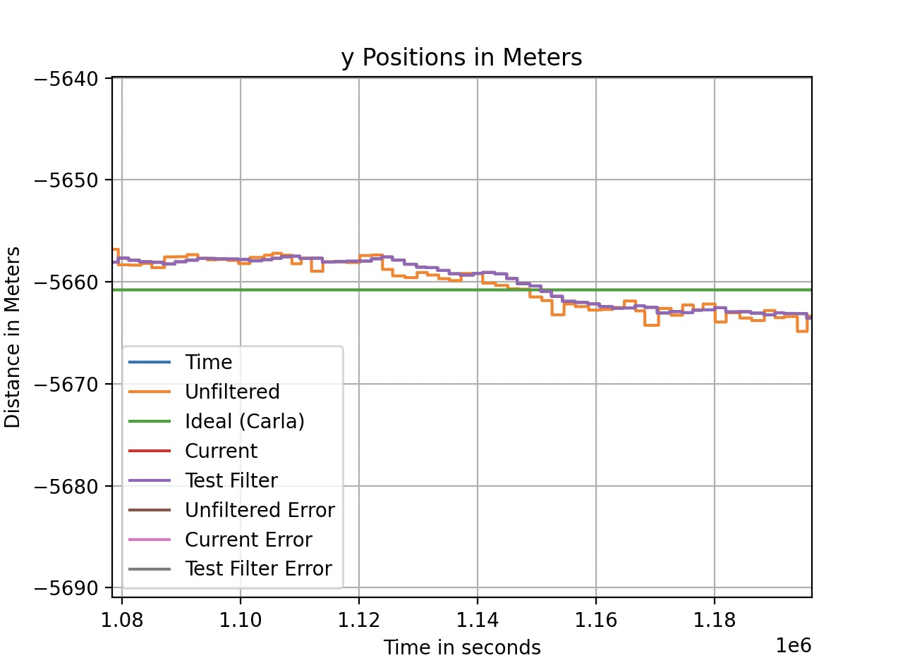
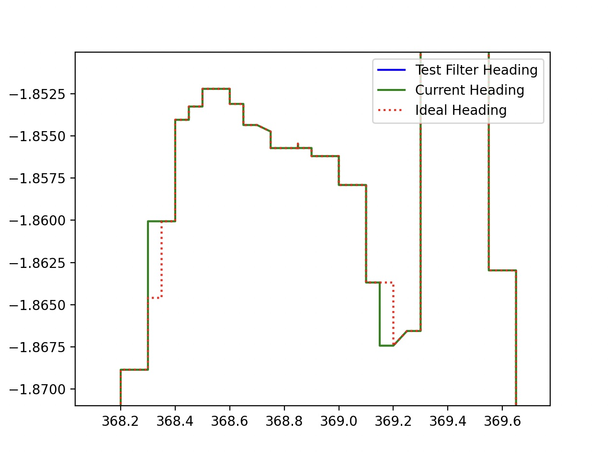

# Extended Kalman Filter

**Summary:**

The Extended Kalman Filter node will be responsible for filtering the position and heading data. Currently the used sensors are an IMU and GNSS sensor together with the CARLA speedometer.

The position is three dimensional but we assume that the car is only driving in a plane right now. That is why the z position and is not estimated by the Kalman Filter but instead is currently calculated using a rolling average.

Currently the state vector of the car is calculated with the data from three different sensors. The goal is to also include sensor fusion in the sense that the heading as well as the acceleration will be calculated using different sensor data. The heading will be derived from the angle of the front wheels (which is provided by Acting) and the acceleration will be calculated using the throttle (which is also provided by Acting).

This file covers the following topics:
- [Theory on linear Kalman Filters](#theory-on-linear-kalman-filters)
  - [1. Prediction (KF)](#1-prediction-kf)
  - [2. Correction (KF)](#2-correction-kf)
- [Implementation of the linear Kalman Filter](#implementation-of-the-linear-kalman-filter)
- [Extending the model](#extending-the-model)
  - [1. Prediction (EKF)](#1-prediction-ekf)
  - [2. Correction (EKF)](#2-correction-ekf)

## Theory on linear Kalman Filters

A Kalman Filter is used to estimate the state of a system. In this case we are interested in the position and heading of the vehicle.
The filter uses discrete time intervals which means that the state is estimated for time steps like $k = 1$, $k = 2$, $k = 3$ and so on. (The letter $k$ is used to make the distinction to the continuous time $t$.)
In the following the time difference between these steps is called $\Delta t$.

For simpler calculations we assume that the car only drives in a plane, so the position only consists of the x- and y-coordinates.
We also want to know the rotation of the vehicle in the x-y-plane, so the rotation around the z-axis. This is also known as yaw but in the following we will call it the heading.

You could think that the state vector should therefore only consist of three components: the x-position, the y-position and the heading.
But to calculate these entries we need some other variables (like the velocity) which are also included in the state vector.

The Filter that was used up until now is a (linear) [Kalman Filter](kalman_filter.md). The state vector looks like this:

$$
\vec{x_s} =
\begin{bmatrix}
    x\\
    y\\
    v_x\\
    v_y\\
    \varphi\\
    \dot{\varphi}\\
\end{bmatrix}
$$

The meaning of the symbols used in the vector and their calculation is explained in the follwing table:

$$
\begin{array}{ c l l }
  \text{symbol} & \text{description} & \text{calculation} \\ \hline
  x & \text{x-position} & x + v_x \cdot \Delta t \\
  y & \text{y-position} & y + v_y \cdot \Delta t \\
  v_x & \text{velocity in x-direction} & v_x \text{ (const.)}\\
  v_y & \text{velocity in y-direction} & v_y \text{ (const.)}\\
  \varphi & \text{heading / rotation around z-axis} & \varphi +  \dot{\varphi} \cdot \Delta t \\
  \dot{\varphi} & \text{angular velocity around z-axis} & \dot{\varphi} \text{ (const.)}\\
\end{array}
$$

After an initialization (of $\^{x}^+(0)$ and $P^+(0)$) the algorithm for the Kalman Filter consists of two steps which get repeated over and over:

### 1. Prediction (KF):

The state and its covariance matrix (the uncertainty of the state) are estimated. The formulas can be seen below (assuming there are no external inputs).
The $\text{ }\^{}\text{ }$ above the $x$ represents that it's an estimate and not the true state of the system.

$\^{x}^-(k) = A(k-1) \^{x}^+(k-1)$

$P^-(k) = A(k-1) P^+(k-1)A^T(k-1) + Q(k-1)$

The matrix $A$ is a matrix that describes how the system operates by itself. So given the state vector and the calculation formulas for the entries the matrix would look like this:

$$
A =
\begin{bmatrix}
    1 & 0 & \Delta t & 0 & 0 & 0 \\
    0 & 1 & 0 & \Delta t& 0 & 0 \\
    0 & 0 & 1 & 0 & 0 & 0\\
    0 & 0 & 0 & 1 & 0 & 0 \\
    0 & 0 & 0 & 0 & 1 & \Delta t \\
    0 & 0 & 0 & 0 & 0 & 1 \\
\end{bmatrix}
$$

The matrix $Q$ is the process noise covariance matrix. This means that it represents how much you trust your model.
The entries in the matrix are set by you and can be adjusted.
If the entries in the matrix are big, this means that there's a lot of uncertainty of the states of the model. As a consequence you trust the measurements more.
If the entries in the matrix are small, this means that you trust the states in the model. As a consequence you trust the model more and the measurements less.

### 2. Correction (KF):

The estimated state gets compared to the measured values. The state and its covariance matrix are corrected according to the error. The formulas are as follows (assuming there are no external inputs).

$K(k) = P^-(k)C^T(k)[R(k) + C(k)P^-(k)C^T(k)]^{-1}$

$\^{x}^+(k) = \^{x}^-(k) + K(k) [y(k) - C(k)\^{x}^-(k)]$

$P^+(k) = [I - K(k)C(k)]P^-(k)[I - K(k)C(k)]^T + K(k)R(k)K^T(k)$

The matrix $K$ is known as the Kalman gain.

The matrix $C$ is the observation matrix. It defines how the state vector is transformed to obtain the predicted measurement​. This ends up being an identity matrix (just like the matrix $I$).

The matrix $R$ is the covariance matrix of the (measurement) noise. Its entries are often estimated and derived from the data sheet of the sensors.

The vector $y$ consists of the measurements.

## Implementation of the linear Kalman Filter

The implementation of this (linear) Kalman Filter can be found in the file [kalman_filter.py](../../code/perception/src/kalman_filter.py)

The [viz.py](../../code/perception/src/experiments/Position_Heading_Datasets/viz.py) file contains helpful functions to visualize and compare the differences between the true position/heading data (taken from the CARLA simulator), the raw data and the filtered data.

The current results from the filter can be seen in the following three pictures.

The first picture shows the x position of the car. The green line represents the true position while the orange line depicts the unfiltered data coming out from the sensor.
The purple line shows the result of the test filter which in this case is the Kalman filter.
It can be seen that the filter follows the measurements too much which results in huge errors (almost 5 meters in the example picture).

The second picture shows the y position of the car. The colors are the same as above.
The filter follows the measurements too much again. Huge errors can also be noticed here (almost 5 meters in the example picture).

The last picture shows the heading of the car.
The dotted red line represents the true heading of the car while the current heading (the green line) is the data produced by the Kalman filter.
It can be seen that the filtered data is really close to the true heading so the focus for the next developed filter should be the improvement of the position data rather than the heading.

## Extending the model

Let's look closer at the calculation of the velocity in the x and y direction.
It is currently assumed that we can measure the velocity in the respective directions independently.

In truth the CARLA Speedometer (the sensor responsible for the velocity measurements) only outputs the velocity ($v$) of the vehicle.
That means that $v_x$ and $v_y$ need to be calculated in the following manner:

$v_x = v \cdot cos(\varphi)$

$v_y = v \cdot sin(\varphi)$

This actually creates a problem because we need to use non-linear functions.
Furthermore the velocities are dependent on the heading angle $\varphi$ which is also an entry in the state vector.

As a result the matrix $A$ can not be used like before anymore.
Instead we linearize the current mean and its covariance.
This means that we will replace the current matrix $A$ with a Jacobian matrix.

Currently it is assumed that the vehicle always drives at a constant velocity.
In a normal car this assumtion is often not satisfied.
So to make the model more accurate we will add the acceleration of the vehicle to the equations.

The measurements for the linear acceleration in each direction (x/y/z) are provided by the IMU sensor.
Just like with the velocity we ignore the acceleration in the z direction for now and continue to assume that the vehicle drives in a plane.

It is worth to mention that the velocity is no longer devided into two state vector entries $v_x$ and $v_y$ but is combined into the entry $v$.

Now the state vector will look like this:

$$
\vec{x_s} =
\begin{bmatrix}
    x\\
    y\\
    v\\
    a\\
    \varphi\\
    \dot{\varphi}\\
\end{bmatrix}
$$

The meaning of the symbols used in the vector and their calculation is explained in the follwing table:

$$
\begin{array}{ c l l c }
  \text{symbol} & \text{description} & \text{calculation} & \text{function} \\ \hline
  x & \text{x-position} & x + v \cdot cos(\varphi) \cdot \Delta t + \frac{1}{2} \cdot a \cdot cos(\varphi) \cdot {\Delta t}^2 & f_1 \\
  y & \text{y-position} & y + v \cdot sin(\varphi) \cdot \Delta t + \frac{1}{2} \cdot a \cdot sin(\varphi) \cdot {\Delta t}^2 & f_2 \\
  v & \text{velocity} & v + a \cdot \Delta t & f_3 \\
  a & \text{acceleration} & \sqrt{a_x^2 + a_y^2} & f_4 \\
  \varphi & \text{heading / rotation around z-axis} & \varphi + \dot{\varphi} \cdot \Delta t & f_5 \\
  \dot{\varphi} & \text{angular velocity around z-axis} & \dot{\varphi} & f_6 \\
\end{array}
$$

As the filter is now non-linear it is called an **Extended Kalman Filter**.
However the basic steps of a Kalman Filter are still maintained even though the formulas are slightly different.

After an initialization (of $\^{x}^+(0)$ and $P^+(0)$) the algorithm consists of the same two steps as before which get repeated over and over:

### 1. Prediction (EKF):

$\^{x}^-(k) = f_D(\^{x}^+(k-1))$

$P^-(k) = A(k-1) P^+(k-1)A^T(k-1) + Q(k-1)$ mit $A(k-1) = \frac{\delta f_D}{\delta x} \vert_{\^{x}^+(k-1)}$

The formula for the matrix $A$ might look a bit intimidating but like mentioned before we just need to calculate the Jacobi matrix.

$$
A =
\begin{bmatrix}
    \frac{\delta f_1}{\delta x} & \frac{\delta f_1}{\delta y} & \frac{\delta f_1}{\delta v} & ... & \frac{\delta f_1}{\delta \dot{\varphi}} \\
    ... & ... & ... & ... & ... \\
    \frac{\delta f_6}{\delta x} & \frac{\delta f_6}{\delta y} & \frac{\delta f_6}{\delta v} & ... & \frac{\delta f_6}{\delta \dot{\varphi}} \\
\end{bmatrix}
= 
\begin{bmatrix}
    1 & 0 & cos(\varphi) \cdot \Delta t & \frac{1}{2} \cdot cos(\varphi) \Delta t^2 & -v \cdot \Delta t sin(\varphi) - \frac{1}{2} \cot a \cdot \Delta t^2 \cdot sin(\varphi) & 0 \\
    0 & 1 & sin(\varphi) \cdot \Delta t & \frac{1}{2} \cdot sin(\varphi) \Delta t^2 & v \cdot \Delta t cos(\varphi) + \frac{1}{2} \cot a \cdot \Delta t^2 \cdot cos(\varphi) & 0 \\
    0 & 0 & 1 & \Delta t & 0 & 0 \\
    ... & ... & ... & ... & ... & ... \\
    0 & 0 & 0 & 0 & 0 & 1 \\
\end{bmatrix}
$$

### 2. Correction (EKF):

$K(k) = P^-(k)C^T(k)[R(k) + C(k)P^-(k)C^T(k)]^{-1}$ mit $C(k) = \frac{\delta g}{\delta x} \vert_{\^{x}^-(k)}$

$\^{x}^+(k) = \^{x}^-(k) + K(k) [y(k) - g(\^{x}^-(k))]$

$P^+(k) = [I - K(k)C(k)]P^-(k)[I - K(k)C(k)]^T + K(k)R(k)K^T(k)$

The matrix $C$ describes how the state vector is transformed to to get the predicted measurement. In our case this results in an identity matrix because the function $g$ basically has no effect and just passes along the state entries.
