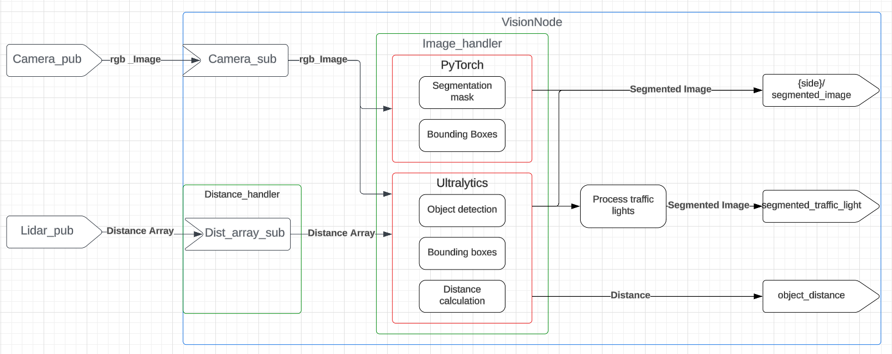

# VisionNode System Overview

The **VisionNode** system processes camera images and LIDAR data to detect objects and calculate their distances. 

## VisionNode System Diagram

(link to lucid chart: https://lucid.app/lucidchart/34e9aa95-5fb3-4d83-b53f-6d6a3f4748c2/edit?viewport_loc=5190%2C-3952%2C1690%2C703%2C0_0&invitationId=inv_83e27eed-e730-4607-836b-0e863cd2b511)
## Data Flow

1. **Inputs**
   - **Camera Input (Camera_pub)**: A camera provides RGB image data, which is fed into the VisionNode system.
   - **LIDAR Input (Lidar_pub)**: A LIDAR sensor supplies distance data used for distance calculations.

2. **Data Handling and Processing**
   - **Image Handler**: The core processing unit within VisionNode, handling the input data from the camera and the distance data given by the **Distance Handler**. The Image Handler utilizes two main frameworks depending on the given model:
     - **PyTorch**: Responsible for image segmentation or generating bounding boxes around detected objects. It creates segmentation masks or bounding boxes based on image data.
     - **Ultralytics**: Focused on object detection, bounding boxes and distance calculations. This module generates bounding boxes for identified objects and calculates distances based on LIDAR input. It also passes data to the traffic light processing

3. **Submodules and Data Processing**
   - **Traffic Light Processing**: This submodule within the Image Handler processes detected traffic lights. Using distance and image data from object detection, it identifies the position of traffic lights and publishes its image data.
   
4. **Outputs**
   - **Camera Publisher**: Publishes the segmented image data after processing by PyTorch, which includes identified objects and their segmentation masks.
   - **Traffic Light Publisher**: Publishes the state and position of traffic lights along with corresponding distance data.
   - **Object Distance Publisher**: Publishes the calculated distances of detected objects based on LIDAR data and object detection results.
