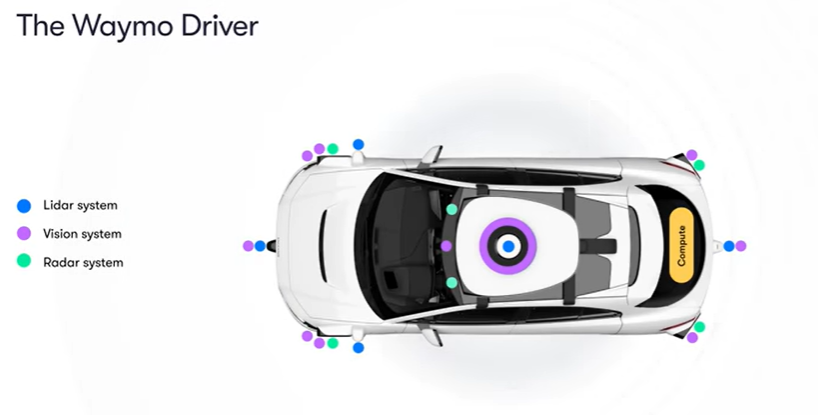

# Real-World Sensor Applications in Autonomous Driving

This research explores the types of sensors used in real-world autonomous vehicles by leading companies, specifically Waymo, Tesla, and Cruise. Understanding their sensor configurations can offer insights beneficial for developing simulations of autonomous vehicles.

## Waymo

- *"There are 29 cameras on our Jaguar I-PACEs."* [[waymo.com](https://waymo.com/waymo-driver/)]
- *"designed with high dynamic range and thermal stability, to see in both daylight and low-light conditions"* [waymo.com]
- The newest (6th) generation of the waymo driver has *"13 cameras, 4 lidar, 6 radar, and an array of external audio receivers (EARs)"* [[waymo.com](https://waymo.com/blog/2024/08/meet-the-6th-generation-waymo-driver/)]
  
## Tesla

- Tesla Cars use no Liadr nor Radar [[teslawissen](https://teslawissen.ch/tesla-autopilot-unterschiede-der-hardware-generationen/)]
- *"12 sensors and 8 cameras, for a total of 20 sensors"* [[Ohio state University news](https://u.osu.edu/engr2367selfdrivingcars/how-does-a-self-driving-car-work-1-false/)]
- *"Tesla Vision Update: Replacing Ultrasonic Sensors with Tesla Vision"* [[Tesla Website](https://www.tesla.com/support/transitioning-tesla-vision)]
  - it is speculated that they do that, to safe cost and because their self driving philosophy is heavily computer vision and deep learning guided. 
- For the newest Hardware of the highest level of autonomy for their car HW4, it was found out that it will have 11 cameras instead of previously 8, some places on the rear bumper, some in the front. [[Tesla magazin](https://teslamag.de/news/neue-autopilot-hardware-tesla-anschluesse-radar-mehr-kameras-56719)]

## Cruise

*"Cruise vehicles are equipped with 40+ sensors, 360° vision, and tested for millions of miles."*[[Cruise](https://www.getcruise.com/)]

## Key Observations

The developers of self driving cars are mostly not sharing too much about their technology and how they use it. Information was mostly found in articles, which made assumptions on the cars.
Overall it was surprising, that:

1. cars are equiped with way more sensors than might be expected
2. it seems as if the leading car developers are focusing now on decreasing the amount of sensors to benefit from lower cost, rather than increasing the number to improve their driving and safety. [[the verge](https://www.theverge.com/2018/3/28/17172666/uber-self-driving-crash-sensor-lidar-email-ducey)]

Also, it seems that thereassets is a trend of using computer vision instead of regular sensors, which is probably caused by the rising improvement in this sector in recent years.

## Future research

It would be interesting to know how these companies connect the information they receive, to create objects to avoid.

## Note

There are restrictions for the Sensors by the Carla leaderboard administration that we have to keep in mind:

*"You can use any of these sensors to configure your sensor stack. However, in order to keep a moderate computational load we have set the following limits to the number of sensors that can be added to an agent:*

    sensor.camera.rgb: 8
    sensor.lidar.ray_cast: 2
    sensor.other.radar: 4
    sensor.other.gnss: 1
    sensor.other.imu: 1
    sensor.opendrive_map: 1
    sensor.speedometer: 1"
